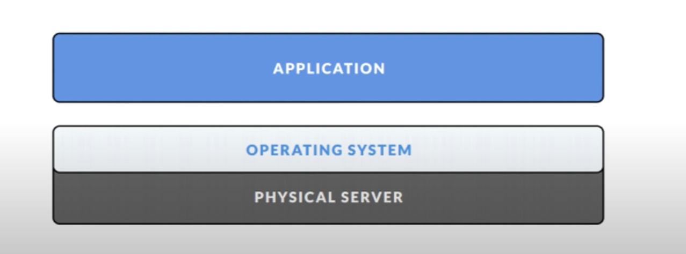
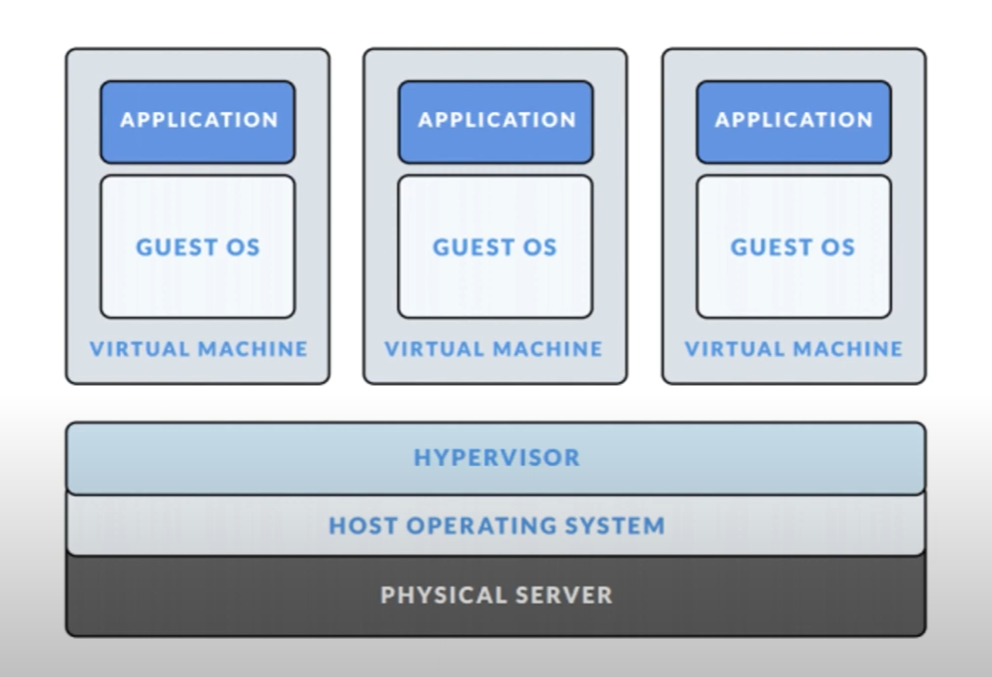
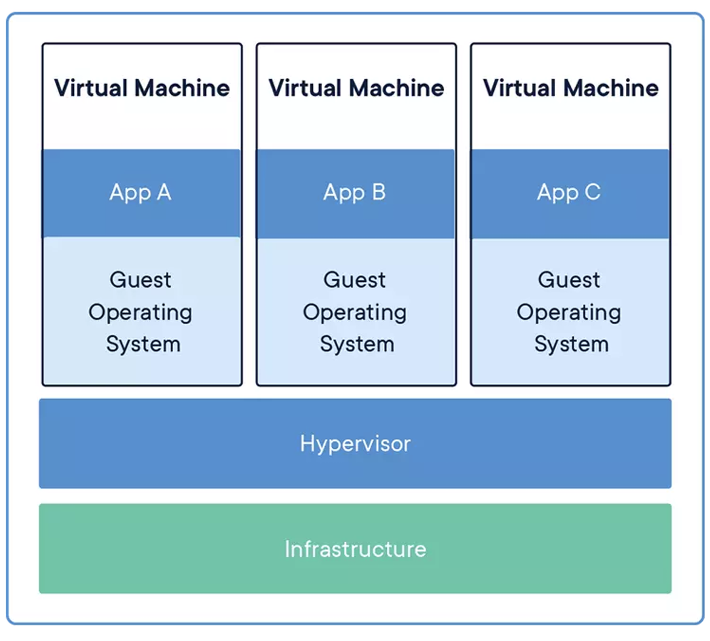
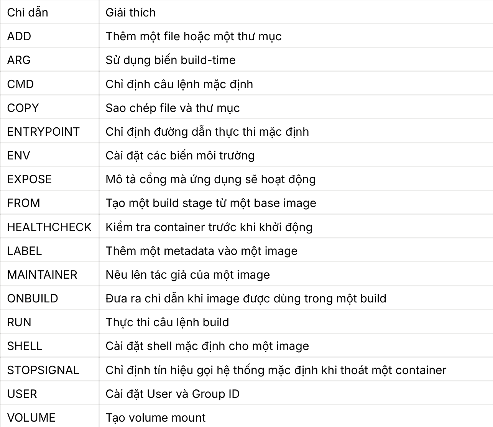
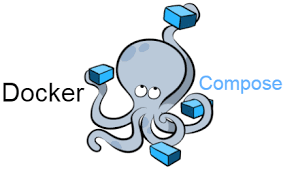

# Tìm hiểu về Docker (P1)
## 1. Docker Engine
### 1.1. Giới thiệu về Docker Engine
- Docker Engine là phần cốt lõi của Docker.
- Công cụ để đóng gói ứng dụng.
- Được xây dựng theo kiến trúc client-server.
- Cài đặt trên máy host.
### 1.2. Các thành phần của Docker Engine
- Có 3 thành phần chính
- **Server**: Docker Daemon dùng để tạo và quản lý các Docker network, volume, images, containers.
- **Rest API**: Controller cho Docker Daemon, chỉ ra những gì Docker Daemon 
sẽ làm
 - **Client**: Công cụ giúp người dùng giao tiếp với Docker host
   + Thông qua Command trong Terminal Docker CLI
   + Docker Client sử dụng API gửi lệnh tới Docker Daemon
## 2. Docker Images
### 2.1. Giới thiệu Docker Images 
* Docker Images là tập hợp những công cụ cần thiết bao gồm source code, các tools, os, dependencies, file, library,... Để chạy một container.
### 2.2. Tính chất, đặc điểm của Docker Images
* **Tính bất biến**: bản chất của docker image là không thể thay đổi vì thế nếu muốn sửa đổi thì chỉ có thể tạo một image mới và thêm thay đổi lên trên nó.
* **Read-only**: những images này đôi khi được gọi là snapshots. Chúng đại diện cho một application và virtual environment của nó tại một thời điểm cụ thể.
* **Không thể Run hoặc Stop**: Vì Image chỉ là các mẫu để từ mẫu đó có thể làm cơ sở để xây dựng một container.
## 3. Docker Container
### 3.1. Giới thiệu Docker Container
* Như chúng ta đã biết Docker Images là tập hợp những công cụ cần thiết để chạy một dự án thì ta có thể hiểu đơn giản Docker Container là nơi để chạy những Docker Images ấy.
### 3.2. Lý do ra đời Container
* Như trước đây để có thể triển khai một dự án sẽ có 2 cách: 
</img>
* Như cách trên ta có thể thấy khá đơn giản chỉ có 3 layers chính nhưng khi triển khai theo cách này sẽ có một nhược điểm là đối với mỗi os sẽ chỉ chạy được một dự án. 
* Để giải quyết vấn đề này ta có cách thứ hai
</img>
* Cách này thì hoàn toàn có thể giải quyết bài toán mà cách 1 đang gặp phải bằng việc sử dụng nhiều VM khác nhau và được quản lý bởi Hypervisor. 
* Tuy nhiên cách này cũng có một nhược điểm đó là việc sử dụng nhiều VM có thể gây tốn memory và CPU hơn bình thường do phải chạy nhiều VM cùng lúc, ngoài ra nó còn có thể gây ra tính unfair trong việc chia sẻ tài nguyên => gây nên việc " cái thừa cái thiếu ".
* Để giải quyết 2 bài toán trên thì Container đã ra đời.
</img>
*  Container là một tiến trình tách biệt cho mỗi thành phần trong ứng dụng của bạn
- Container có các đặc điểm:
  + **Tự chứa**: Mỗi Container có mọi thứ nó cần để hoạt động và không bị 
phụ thuộc vào bất cứ môi trường nào có trong máy
  + **Tách biệt**: Mỗi Container chạy trong môi trường riêng của nó, do đó có rất ít tương tác với máy host hay các container khác, tăng cường bảo mật của ứng dụng
  + **Độc lập**: Mỗi Container được quản lí độc lập, xóa một container sẽ 
không ảnh hưởng tới những container khác
  + **Gọn nhẹ**: Container có thể chạy ở mọi nơi, từ máy cá nhân tới trung tâm dữ liệu hay trên đám mây
## 4. Dockerfile
### 4.1. Giới thiệu Dockerfile
* Dockerfile là một file dạng text không có phần đuổi mở rộng, chứa các đặc tả về môi trường thực thi phần mềm, cấu trúc cho Docker Image
* Docker Images được tạo ra từ việc đọc các chỉ dẫn trong Dockerfile
* Từ những câu lệnh đó Docker sẽ build ra Docker Image
### 4.2. Một số command trong Dockerfile
</img>
## 5. Docker-Compose
### 5.1 Giới thiệu Docker-Compose
</img>
* Docker compose là công cụ dùng để định nghĩa và run multi-container cho Docker application. 
* Với compose bạn sử dụng file YAML để config các services cho application của bạn. Sau đó dùng command để create và run từ những config đó. Chỉ với ba bước:
  + Khai báo app’s environment trong Dockerfile.
  + Khai báo các services cần thiết để chạy application trong file docker-compose.yml.
  + Run Docker-Compose up để start và run app.
* Khác với Dockerfile dùng để build các image, Docker-compose dùng để build và run các container
